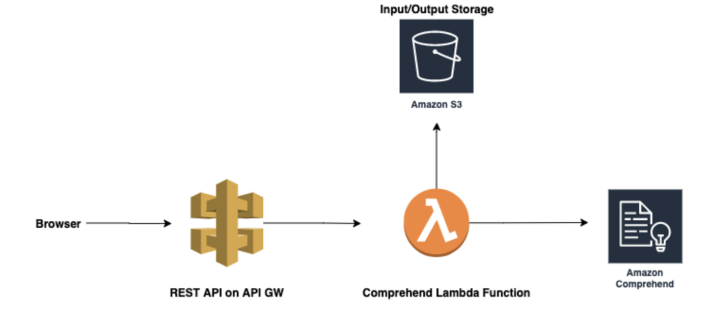

# SentimentAnalysisApp
Web application that works with AWS Comprehend to visualize sentiment of user input.

# Architecture

# Demo

# Corresponding Medium Article
https://towardsdatascience.com/building-full-stack-serverless-nlp-applications-with-javascript-aws-c63ca365cd15
